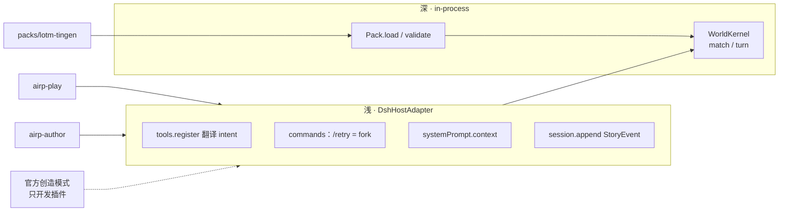
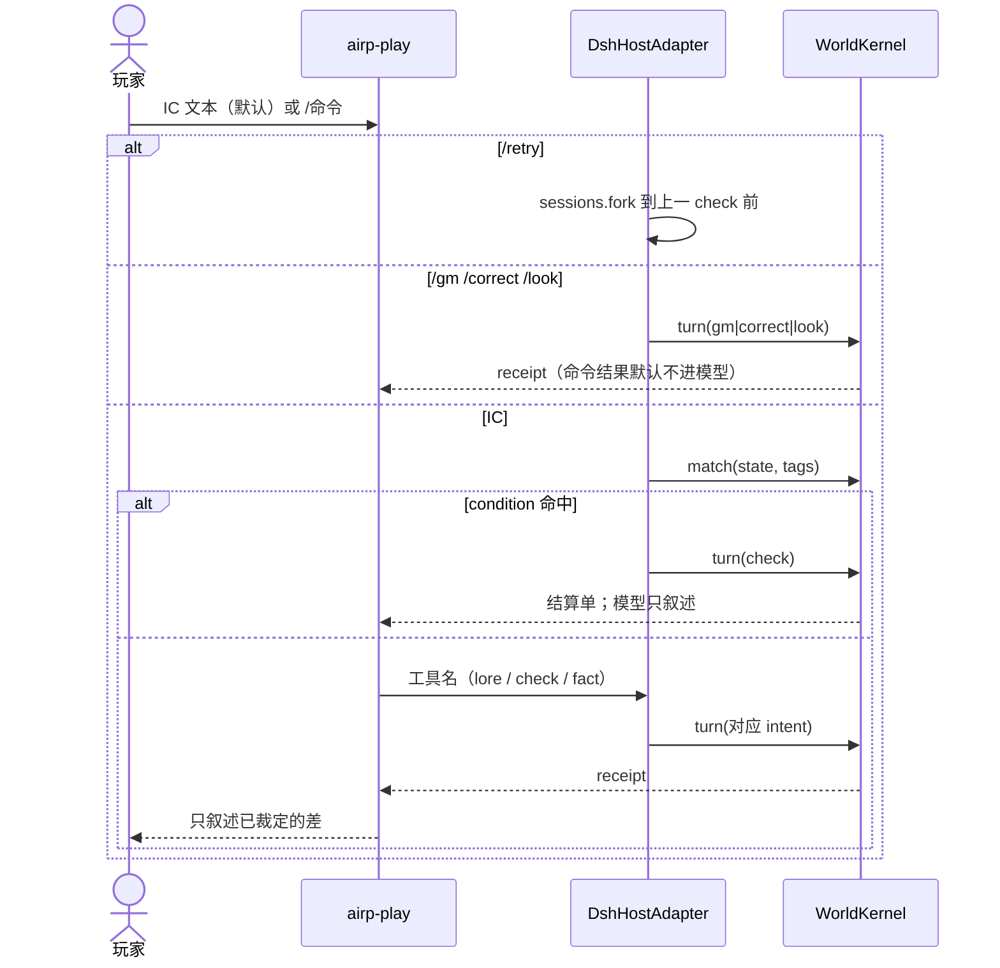

# DSH AIRP 引擎方案

- 日期：2026-08-18
- 状态：v1.1（按 codebase-design 收成单一深 module；删假缝）
- 配套：[ADR-0008](./adr/0008-st-as-reference-and-asset-mine.md) … [ADR-0011](./adr/0011-check-engine-declarative-and-optional-conditions.md)（从 notes/tavern-ai-native 收编）
- 证据：SillyTavern v1.18.0；DSH 0.1.0-rc.6

一句话：**一个深 module `WorldKernel`，外加一层 DSH adapter。LLM 只提案和叙述；规则把 State 从 T 写成 T+1。v0 用廷根切片证明这比酒馆值得玩。**

---

## 0. 为什么不再用酒馆当宿主

| 酒馆有的 | 酒馆没有的 |
|---|---|
| 关键词世界书、token 预算、约 31 个条目字段 | 独立鉴定层 |
| `{{roll}}` 把数字写进文本 | 骰子与胜负的硬约束 |
| `{{setvar}}` / QR / regex 间接触发写变量 | schema；鉴定失败则不写 |
| 角色卡 = 人设 + 提示词模板 | 人设与可变状态分离 |
| 生成管线不回写世界书 | 诚实的 T→T+1 |

要补的是裁决原语，不是又一份世界书 JSON。骰子只是随机源 ξ。DSH 已有 function calling、guard、仅追加 session、`sessions.fork`。ST 只当对照代码和资产矿（ADR-0008），不追求格式兼容（D1）。

---

## 1. 唯一深 module：WorldKernel

产品上仍是「Host 插件 + 两个 Preset」。那是部署。领域行为只加深这一刀：

```text
WorldKernel
  match(state, tags) → ForcedCheck[]
  turn(intent)       → { state, receipt, events }
```

调用方必须知道的全部事实：

- 数值字段只能经 `check` 或 `gm` 改变；`fact` / `correct` 碰白名单即整单拒绝，State 不变。
- `events` 为空 = 本回合无转移。
- 同一 `rng_seed` + 同一 check 序号 ⇒ 同一 `u`、同一 outcome。
- 错误：`UNKNOWN_CHECK` / `CHANNEL_VIOLATION` / `BUDGET` / `INVALID_CONDITION` / `MISSING_REASON`。
- Kernel **不**读盘、**不**碰 DSH、**不**做时间旅行。Canon 与事件数组由调用方传入。

```ts
type Intent =
  | { type: "look"; pointer?: string }
  | { type: "lore"; key: string }
  | { type: "check"; checkId: string; actors: Record<string, string> }
  | { type: "fact"; pointer: string; value: unknown }
  | { type: "gm"; patch: Patch; reason: string }
  | { type: "correct"; pointer: string; value: unknown }

type TurnResult = {
  state: WorldState
  receipt: Receipt      // 结算单或文档切片，给模型看
  events: StoryEvent[]  // 普通对象，不是 DSH JSONL 信封
}
```

`match` 与 `turn` 是同一 module 的两个入口，不是两个 module。`match` 只跑 Canon 里的谓词 AST，不解析 IC 自然语言。

删除测试：删掉 WorldKernel，序列差、白名单、种子、fold 会散到工具函数和斜杠里各写一份——所以它赚得过这份 interface。

---

## 2. 部署形态（浅，这是它的职责）



| 东西 | 角色 | 不是 |
|---|---|---|
| WorldKernel | 深 module | 一簇 `check-engine.ts` / `fold.ts` 平铺导出 |
| Pack | `load(dir)` / `validate(pack)` | 第二种装载源出现前不为 fs 做 port |
| DshHostAdapter | 把 Cordis ctx 译成 `turn` / `match` | 领域逻辑 |
| airp-play / airp-author | 可见性掩码 + persona | module |
| 官方 `cordis_*` | 开发插件 | 故事会话 |

会话一旦有产出不能热换 preset。换身份 = 新会话。`/retry` 是 `sessions.fork`，Adapter 的事，Kernel 不管。

v0 **没有**：`present` port、世界时钟、`canon.edit` / `check.define` 工具、storage-domain、向量检索。

---

## 3. 三层数据

Canon 版本化，author 改文件。State 是投影。Session 里的 `StoryEvent[]` 是真源；Adapter 再写成 DSH 日志。

```text
packs/lotm-tingen/
  pack.yaml
  index.yaml
  checks/{contest-sequence,digest-acting,lose-control}.yaml
  characters/{klein-moretti,dunn-smith}.md
  lore/{axioms,fool-s9-s8,tingen,night-watchers}.md
```

`index.yaml` 经 `systemPrompt.context` 常驻；细节只在 `turn({type:"lore"})` 时按 key 取出，超预算则 `BUDGET`。

State 最小形状：

```yaml
turn: 0
scene: tingen.blackthorn
rng_seed: "<pack+session>"
revealed: [axioms, tingen]
present: [klein, dunn]
characters:
  klein: { pathway: fool, sequence: 9, digest: 0.2, lose_control: 0.1 }
  dunn:  { pathway: sleepless, sequence: 7, digest: 1.0, lose_control: 0.0 }
facts: { weather: "雾", alarm: false }
```

`sequence` / `digest` / `lose_control` 以及胜负、晋升、资源列入鉴定通道。其它指针才允许 `fact`。

角色卡是 Canon 人设（口吻、外形、对外身份、声明途径）。可变进度只活在 State。出场且会说话或被鉴定的人必须有卡；路人可标 `provisional`，不写回包。Play 召已有卡上场：IC 点名或 `/gm present=+id :: 理由`。不新增 play 工具。新卡由 author 改文件，不在 play 会话 mint。

事件（Kernel 产出，Adapter 落盘）：

| type | 来源 |
|---|---|
| `check` | `turn({type:"check"})` 或 `match` 强制后的 check |
| `apply` | 非抽样补丁（少用） |
| `fact` | `turn({type:"fact"})` |
| `gm` | `turn({type:"gm"})`，无 reason 拒绝 |
| `correct` | `turn({type:"correct"})` |

崩溃：重放事件重建投影。热路径保留 fold 缓存——fold 是 Kernel **internal seam**，不导出。

---

## 4. 一回合



同一 agent，无后台时钟。离场 NPC 冻结，直到被索引或行动唤醒。

模型可以仍看见多把工具（function calling 要名字）。那是 Adapter 翻译，**不是** Kernel interface。测试禁止直接打七个工具函数。

作者 condition 命中时，Adapter 在调模型**之前**就 `turn(check)`。模型这一轮只拿到结算单，不能跳过。未写 condition 的包，仍靠模型 `check` 提案 + Kernel 门禁。

---

## 5. 鉴定

触发：

```text
match(state, tags) 命中 ⇒ 必须 turn(check)，模型不能跳过
否则仅当 turn({type:"check"}) 且门禁通过
日常 ⇒ events = []
```

`condition` 是 Canon 数据，Pack.validate 收成 **谓词 AST**（路径、比较、与或）。Kernel 只执行 AST。禁止把 JS 源码当成 `turn` 的参数。若作者坚持代码谓词：只允许在装载期编成 AST，禁止 IO / 全局；滥用则只留 JSON DSL。

声明式 check（廷根）。`sequence` = 序列号，**越小越强**。

```yaml
id: contest-sequence
when: "两名非凡者直接对抗"
kind: contest
condition:
  all:
    - { tag: contest }
    - { present: ["$attacker", "$defender"] }
inputs:
  atk: "characters.{attacker}.sequence"
  def: "characters.{defender}.sequence"
  same_pathway: "eq(characters.{attacker}.pathway, characters.{defender}.pathway)"
formula: |
  strength = def - atk          # S9 打 S8：9-8=1，攻方更弱，p < 0.5
  p = sigmoid(-strength / 1.5)  # 攻方序列号更大 ⇒ p 更低
  if same_pathway: p = clamp(p + 0.05)
outcomes:
  success:
    apply: { "facts.last_contest": "attacker" }
  failure:
    apply:
      "facts.last_contest": "defender"
      "characters.{attacker}.lose_control": "+0.05"
```

v0 默认 ξ：存档种子派生 `u ~ Uniform(0,1)`，`u < p` 成功。测试注入 `u` 或 `none`（纯公式）。d20 / 2d6 不是 LOTM 默认，作者可在 pack 里声明，模型不能选。

结算单（receipt）示例：

```json
{
  "check_id": "contest-sequence",
  "inputs": {"attacker": "klein", "defender": "opponent", "p": 0.27},
  "xi": {"kind": "bernoulli", "u": 0.81},
  "outcome": "failure",
  "patch": {"characters.klein.lose_control": 0.15, "facts.alarm": true}
}
```

双通道：

| 字段 | 谁能写 |
|---|---|
| 序列、消化、失控、资源、胜负、晋升、场景、在场、clock.beat | 仅 check / gm |
| 天气、已揭示设定 | fact / correct。不可写 `facts.scene` / `facts.present` / `facts.clock`（受保护根的克隆） |
| Canon 文本 | 作者改文件 + `Pack.validate`，play 无写口 |

叙述后抽查「你晋升了」但无对应事件：v0 只打警告，不阻断、不改 State。

---

## 6. Adapter 对 DSH 暴露什么

对模型仍是几把工具，内部一律 `turn`：

| 工具 / 命令 | play | author | 实际 |
|---|---|---|---|
| `lore_get` / `state_read` | ✓ | ✓ | `turn(lore\|look)`。`lore_get` 的 key 也可以是角色卡 id，返回卡的 body（口吻/外形/对外身份），预算同 lore。收据仍是 `kind: lore`；未知 id 仍 `UNKNOWN_LORE` |
| `check_propose` | ✓ | ✓ | `turn(check)`；condition 已强制时本轮不必再调 |
| `state_propose_fact` | ✓ | ✓ | `turn(fact)` |
| `pack_validate` | | ✓ | `Pack.validate`，不经 `turn` |
| `/look` `/state` | ✓ | ✓ | `turn(look)`；结果默认不进模型 |
| `/retry` | ✓ | ✓ | `sessions.fork`，不是 turn |
| `/gm` `/correct` | ✓ | ✓ | `turn(gm\|correct)` |
| `/ooc` | ✓ | ✓ | 不推进世界 |
| `canon.edit` / `check.define` | | | **v0 不做**。作者用手改 YAML/MD |
| bash / `cordis_*` | ✗ | ✗ | 开发走官方创造模式 |

包必须在工作区（如当前 workspace 的 `packs/`）。preset 不能放松 sandbox。

---

## 7. 表现

v0：模型读 `receipt` 写散文。没有 `present` module。参考图可当附件给模型看，那不是表现引擎。生图 / TTS 出现第二种实现时再提 seam。

---

## 8. v0 廷根切片

- 地点：廷根，值夜者据点 / 一条街区
- 人物：克莱恩（愚者 S9）+ 2～3 名值夜者 + 1 个对手
- 机制：非凡隐秘、特性不灭、序列差、扮演消化、失控
- 一条线：委托 → 调查（可以只有 fact）→ 一次对抗鉴定 → 一次消化或失控鉴定 → `/retry` 回到对抗前

DoD：

1. `airp-play` 开 `lotm-tingen`，不打开 ST。
2. 闲聊 / 走路：`events=[]`。
3. 对抗产生带 p、ξ、patch 的 check；叙述与 patch 一致。
4. 模型说「你晋升了」但无事件 → 序列不变。
5. `/retry` 后 State 回到鉴定前，旧线仍在。
6. 作者改 check YAML，`Pack.validate` 通过后，**新** play 会话吃到新规则。

非目标：22 途径、塔罗会、Worldsmith、市场、故事视图、生图、边玩边写 Canon。

---

## 9. 仓库

三份东西，不要塞进同一个 `src/` 平铺：

```text
dsh-airp/                    # 插件仓 = Kernel + Adapter
  package.json               # dsh.bundle.patch
  cordis.patch.yml
  src/
    kernel/                  # WorldKernel：turn / match / fold（不导出 fold）
    pack/                    # load / validate
    host/                    # DshHostAdapter
  tests/                     # 只打 TurnResult / Pack 诊断
packs/lotm-tingen/           # 数据，独立目录
~/.dsh/.agent-presets/
  airp-play/
  airp-author/               # 从最小壳 copy，只改工具掩码
```

`dsh plugin --profile web add ./dsh-airp`。测试 `load(fixturePack)` 后直接 `turn`，不 `apply(ctx)`。

---

## 10. 测试面（interface = test surface）

| 意图 | 只断言 `TurnResult` |
|---|---|
| S9 打 S8，注入 `u=0.81` | failure；`lose_control` +Δ；`p < 0.5` |
| 走路 / 无 check | `events=[]` |
| fact 指向 `lose_control` | `CHANNEL_VIOLATION`，State 不变 |
| `match` 命中后 `turn(check)` | 有 check 事件，即使没有模型 |
| gm 无 reason | `MISSING_REASON` |
| 同一 seed 重放 | 同一 `u`、同一 outcome |

Pack.validate：坏指针、数值字段出现在 fact schema、非法 condition、在场人物缺卡。

Adapter 测试只覆盖：工具名译成 intent、play 掩码看不见 validate、`/retry` 调 fork。不准再测序列差。

---

## 11. 对抗审查（仍成立的）

| 攻击面 | 缓解 |
|---|---|
| 模型不调工具、口头改判 | 无事件则数值不变；condition 命中时模型根本来不及跳过 |
| 乱 propose | Kernel 门禁；未知 check 拒绝 |
| condition = 任意 JS | 只执行 AST；装载期编译 |
| fact 走私数值 | 指针白名单，整单拒绝 |
| `/gm` 当常规 | 必须 reason；审计事件 |
| 刷 `/retry` | 产品接受 |
| lore 拉全书 | 单 key 预算 |
| 与创造模式同进程 | AIRP preset 禁止 `tool-cordis` |
| 包在 workspace 外 | 写失败，不绕 sandbox |
| 长线 fold 变慢 | 以后加 `snapshot` 事件，不改真源 |
| KV cache 抖动 | 索引稳；动态只走 context |

刻意不复刻：31 字段扫描器、装饰宏、dry-run 写变量、PNG 卡当运行时、群聊发言权当世界规则。

最大产品风险仍是做成没有角色的规则测试床。切片必须有口吻、据点和一条委托。

---

## 12. 以后

| 阶段 | 做 | 不做 |
|---|---|---|
| v0 | 本文 DoD | Worldsmith、市场、生图、全书、`present`、`canon.edit` |
| v1 | Worldsmith、provisional 晋升、因果抽查阻断、第二种表现出现再提 present seam | SaaS |
| v2 | 语义迁移 ST 资产、可选世界时钟 | 把 ST 请回宿主 |

实现顺序：Kernel + 对抗单测 → `lotm-tingen` → Adapter + `airp-play` → `/retry` `/gm` → `airp-author` + validate → 手玩委托。
